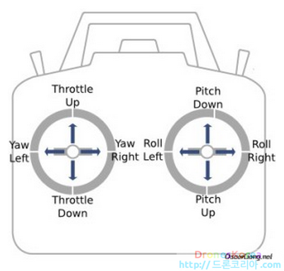

#Tello_openpose.py

* 코드 구성  
> ㄴCameraMorse.py  
> ㄴFPS.py  
> ㄴOP.py  
> ㄴSoundPlayer.py  
> ㄴtello_openpose.py  
  

## telloCV.py와의 비교 (0) - 멀티프로세스  
  
 이 프로그램은 멀티프로세스를 사용한다.   
 child process('worker')를 생성해 낸 후 2가지 프로세스로 나뉘어 분업을 하게된다.  
> `부모 프로세스의 역할` 
> - 텔로로부터 비디오 스트림을 받아와 opencv window에 display함.  
> - 자식 프로세스의 목적지 주소에 공유메모리로 각 프레임을 저장.  
> - 자식으로부터 파이프를 통해 EXIT 커맨드를 읽는다.  
  
> `자식 프로세스의 역할` 
> - 공유메모리로부터(openpose&write_hud) 프레임을 읽는다.  
> - 트래킹 동작 실행 &  키보드 지시 읽어오기.  
> - 텔로와의 명령 및 리턴값  송수신  
  
  
이러한 방식을 통해, 기존 소스코드의 process_frame()함수 내에 존재하였던 raw_frame값을 cv2 image로 변환하는 기능을 main()으로 옮겨놓았음.  

```python
def main(use_multiprocessing=False, log_level=None):
    global tello
    
    if use_multiprocessing:
        # Create the pipe for the communication between the 2 processes
        parent_cnx, child_cnx = Pipe()
    else:
        child_cnx = None

    tello = TelloController(use_face_tracking=True, 
                            kbd_layout="AZERTY", 
                            write_log_data=False, 
                            log_level=log_level, child_cnx=child_cnx)
   
    first_frame = True  
    frame_skip = 300

    for frame in tello.container.decode(video=0):
        if 0 < frame_skip:
            frame_skip = frame_skip - 1
            continue
        start_time = time.time()
        if frame.time_base < 1.0/60:
            time_base = 1.0/60
        else:
            time_base = frame.time_base

        
        # Convert frame to cv2 image
        frame = cv2.cvtColor(np.array(frame.to_image(),dtype=np.uint8), cv2.COLOR_RGB2BGR)
        frame = cv2.resize(frame, (640,480))
        if use_multiprocessing:
            
            if first_frame:
		#디코드 후 자식에게 일을 맡김
                frame_as_ctypes = np.ctypeslib.as_ctypes(frame)
                tello.shared_array = sharedctypes.RawArray(frame_as_ctypes._type_, frame_as_ctypes)
                tello.frame_shape = frame.shape
                first_frame = False
                # 자식프로세스 생성
                p_worker = Process(target=openpose_worker)
                p_worker.start()
            # Write the current frame in shared memory
            tello.shared_array[:] = np.ctypeslib.as_ctypes(frame.copy())
            # Check if there is some message from the child
            if parent_cnx.poll():
                msg = parent_cnx.recv()
                if msg == "EXIT":		#종료요청을 받아옴
                    print("MAIN EXIT")
                    p_worker.join()
                    tello.drone.quit()
                    cv2.destroyAllWindows()
                    exit(0)
        else:
            frame = tello.process_frame(frame)
            tello.sound_player.play()

        if not use_multiprocessing: tello.fps.update()	#멀티프로세스 사용안하면 자기가 그냥 함

        # Display the frame
        cv2.imshow('Tello', frame)
        cv2.waitKey(1)

        frame_skip = int((time.time() - start_time)/time_base)
```

  
  
## tellpCV.py와의 비교(1) - PID controller & Drone movement (yaw,roll,pitch,throttle)

<p align="center">
    
</p>  

드론 제어는 PID 제어를 기본으로 하고 있으며 영상처리 과정과 드론을 제어하기 위한 모터의 RPM 변화 속도를 고려하여 PID 결과값의 최대값과 최소값을 드론의 상태에 따라 유동적으로 적용시켜야 한다. 드론의 상하좌우 및 이동 속도를 담당하는 Throttle, 좌우로 이동할 수 있는 Roll, 앞뒤로 이동하는 Pitch, 드론의 회전을 담당하는 Yaw에 각각 소프트웨어로 구성된 PID 제어기 모듈을 적용한다. 드론 한 대에 소프트웨어로 구현된 PID 제어모듈 4개가 적용되며 각각의 PID 제어 모듈은 독립적으로 동작한다.  

```python
log = logging.getLogger("TellOpenpose")
# ~~~~~
        self.axis_command = {
            "yaw": self.drone.clockwise,
            "roll": self.drone.right,
            "pitch": self.drone.forward,
            "throttle": self.drone.up
        }
```
- main부분( Main 실행시 log_level을 1.info, 2.debug로 입력받음 )

```python
        # Send axis commands to the drone
        for axis, command in self.axis_command.items():
            if self.axis_speed[axis]is not None and self.axis_speed[axis] != self.prev_axis_speed[axis]:
                log.debug(f"COMMAND {axis} : {self.axis_speed[axis]}")
                command(self.axis_speed[axis]) ##명령실행(openpose내 유일한 command명령
                self.prev_axis_speed[axis] = self.axis_speed[axis]
            else:
                # This line is necessary to display current values in 'self.write_hud'
                self.axis_speed[axis] = self.prev_axis_speed[axis]
```
- process_frame() 함수에서 opencv와 동일하게 동작을 실행시키지만 getattr가 아닌 command()를 사용해준다.  
  
```
'command' is a python function
kwargs is a optionnal dictionary of keyword arguments that will be passed to function 'command' 
when it will be called. Called this way: command(**kwargs)
```
라고 CameraMorse.py에서 추가 기재가 되어있기는 하지만, 구글링을 암만해봐도 <https://thdev.net/226> 이것만 나오고 해당 공식 레퍼런스 링크는 삭제되어 있는 듯 하다. 어느모듈에서 쓴거인지 모르겠음. sys.command() os.command()이런것도 아니라 더 뭐지 싶음.. 소스코드를 실행해봐야 해당 명령이 실행되는지 알 수 있을 듯
  
  

## telloCV.py와의 비교(2) - log_data_handler  

>Import logging in python :  
><https://docs.python.org/ko/3/library/logging.html>  
  
```python
    def init_drone(self):
        """
            Connect to the drone, start streaming and subscribe to events
        """
        if self.log_level :
            self.drone.log.set_level(2)
        self.drone.connect()
        self.set_video_encoder_rate(2)
        self.drone.start_video()

        self.drone.subscribe(self.drone.EVENT_FLIGHT_DATA,
                             self.flight_data_handler)
        self.drone.subscribe(self.drone.EVENT_LOG_DATA,
                             self.log_data_handler)
        self.drone.subscribe(self.drone.EVENT_FILE_RECEIVED,
                             self.handle_flight_received)
```
이 프로그램에서는 init_drone()에서 self.drone.EVENT_LOG_DATA라는 데이터를 하나 더 불러온다.  
  
```python
    def log_data_handler(self, event, sender, data):
        """"
            Listener to log data from the drone
        """  
        pos_x = -data.mvo.pos_x
        pos_y = -data.mvo.pos_y
        pos_z = -data.mvo.pos_z
        if abs(pos_x)+abs(pos_y)+abs(pos_z) > 0.07:
            if self.ref_pos_x == -1: # First time we have meaningful values, we store them as reference
                self.ref_pos_x = pos_x
                self.ref_pos_y = pos_y
                self.ref_pos_z = pos_z
            else:
                self.pos_x = pos_x - self.ref_pos_x
                self.pos_y = pos_y - self.ref_pos_y
                self.pos_z = pos_z - self.ref_pos_z
        
        qx = data.imu.q1
        qy = data.imu.q2
        qz = data.imu.q3
        qw = data.imu.q0
        self.yaw = quat_to_yaw_deg(qx,qy,qz,qw)
        
        if self.write_log_data:
            if self.write_header:
                self.log_file.write('%s\n' % data.format_cvs_header())
                self.write_header = False
            self.log_file.write('%s\n' % data.format_cvs())
```

reset함수에서 `self.ref_pos_x = -1`, `self.ref_pos_y = -1`, `self.ref_pos_z = -1`으로 초기화해놓음으로써, 
```python
def quat_to_yaw_deg(qx,qy,qz,qw):
    yaw = int(atan2(siny,cosy)/degree)
    """return yaw"""
        Calculate yaw from quaternion(오일러각 대신 회전을 표현하기 위한 사원수)
```
를 통해, 드론의 궤적과 회전 데이터를 저장할 수 있다.  
  
- *search keyword* : `monocular visual odometry(MVO)`, `IMU`   
<https://snacky.tistory.com/96>   
<http://www.chrobotics.com/docs/AN-1006-UnderstandingQuaternions.pdf>  
  

  

## TelloCV.py와 비교 (3) - process_frame & check_pose()
  
- openpose와 관련있는 부분  
*dialogflow와 연동 후 다시 분석할 예정*  

 
```python

def distance(A, B):
    return int(sqrt((B[0]-A[0])**2 + (B[1]-A[1])**2))
        """Calculate the square of the distance between points A and B"""

def angle (A, B, C):
    return degrees(atan2(C[1]-B[1],C[0]-B[0]) - atan2(A[1]-B[1],A[0]-B[0]))%360
        """Calculate the angle between segment(A,p2) and segment (p2,p3)"""

def vertical_angle (A, B):
    return degrees(atan2(B[1]-A[1],B[0]-A[0]) - pi/2)
        """Calculate the angle between segment(A,B) and vertical axe"""

```
